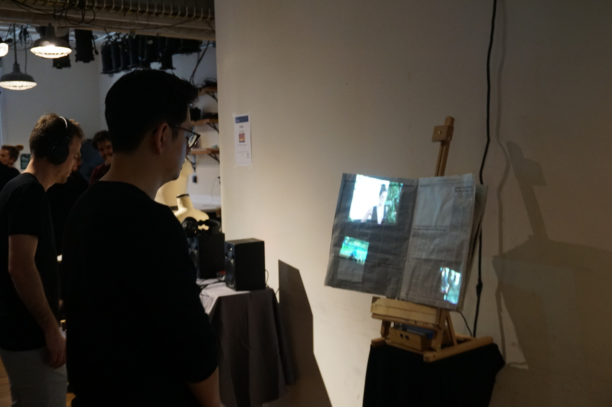
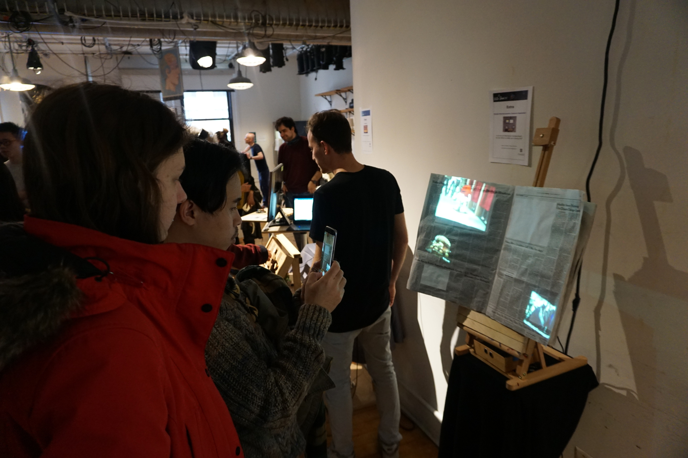
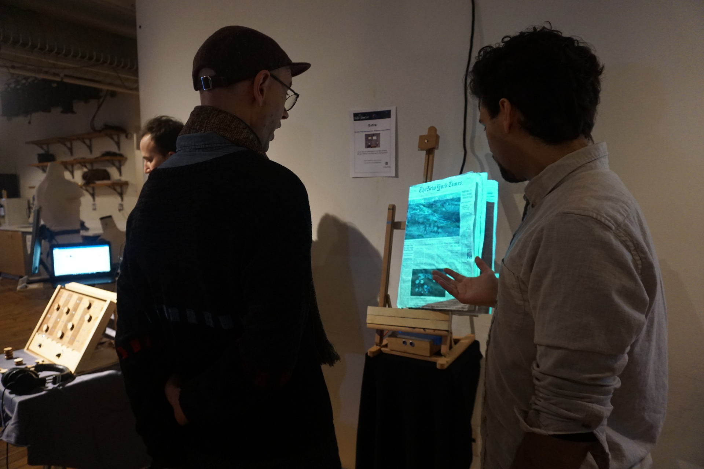
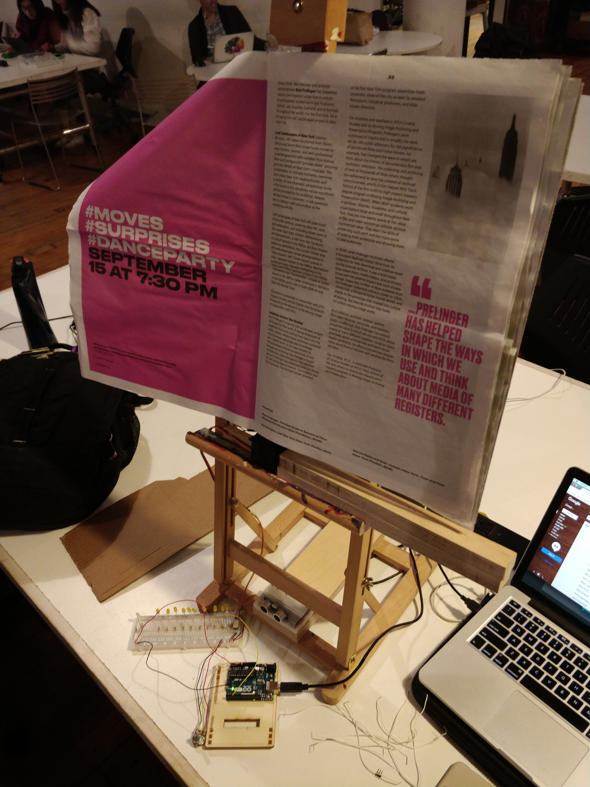
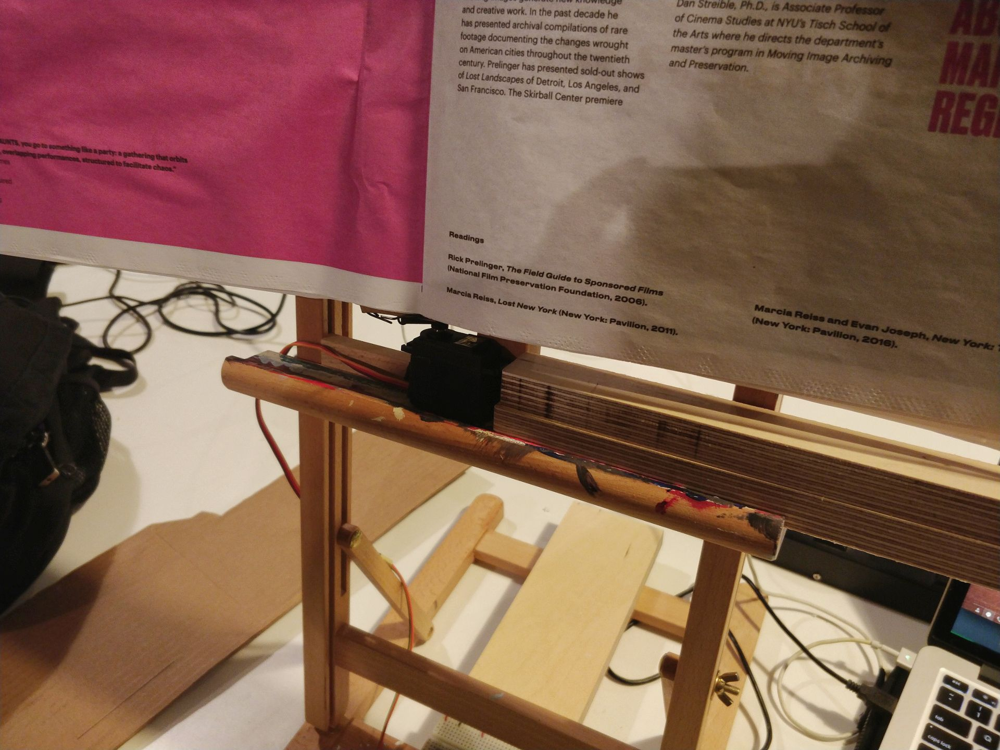
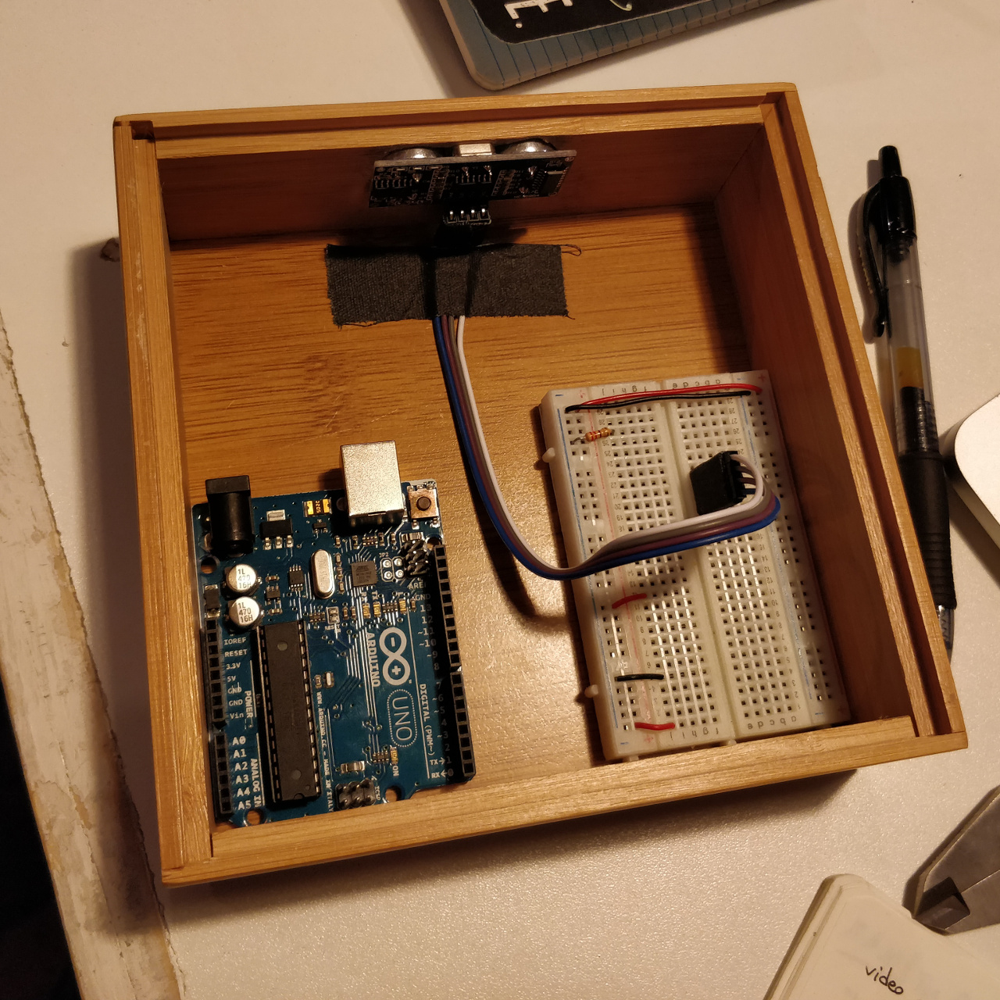

# extra

In an era of information bombardment, do we reflect on what we're being told?

Extra is an interactive conceptual exhibition piece. It combines a newspaper with sensors and projection mapping of news media to generate a reflection about media bombardment and the role of information.
<!--more-->

## Concept
Advertisement, the entertainment industry, sports,... we're flooded by a constant stream of shallow content. This barrage of stimuli surrounds us in every environment we inhabit, both physical and virtual.

What is all this content we're being fed?

Upon close inspection, we realize it is only noise. There's no real matter, no information behind it all. It has been carefully designed to hijack our attention and lure us to their channels.

> Marketing is the language of news media, not information.

The idea was born as a reflection on the state of news media. The focus on information was lost in favor of clickbaiting. Views and revenue rate much higher in their scale of importance, rather than public knowledge. This was seen in the 2016 election, where the media gave Trump an overwhelming amount of attention due to the views he generated.

In order to generate this reflection, we overlapped a newspaper -the physical and traditional medium of information- with video projections of different topics, representing the digital contemporary medium-. This is connected to an Arduino controlled servo motor and a proximity sensor.

As soon as the attention of a member of the audience gets captured and approaches the creation, the sensor triggers the motor, closing the newspaper immediately. At the same time, the projection changes from the media content to white noise, revealing the lack of content of the original media.

## The Technology behind
The software behind extra was a combination of two parts:

1. An Arduino controlling the servo motor and the proximity sensor, which communicates with...
2. A Processing sketch feeding the corresponding videos via Syphon to [MadMapper](http://madmapper.com/), a projection mapping software

All the code can be found on the [Github repository](https://github.com/nicolaspe/extra).

#### Newspaper mounted in place

#### Zoom to servo mechanism

#### Arduino and sensor enclosure

